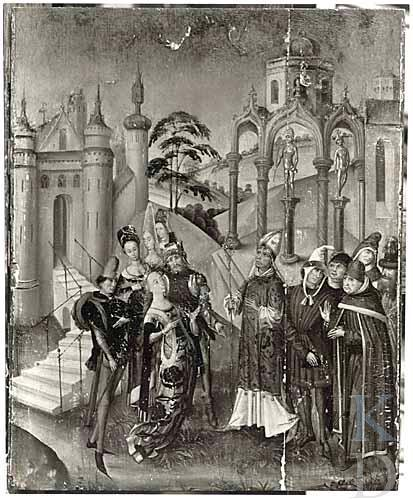
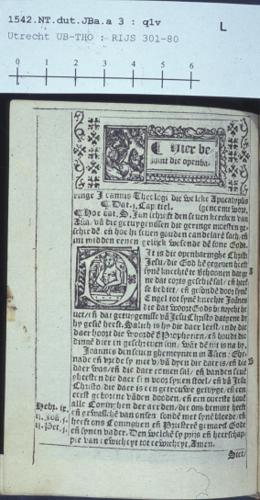
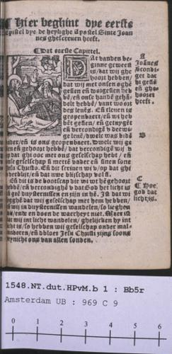
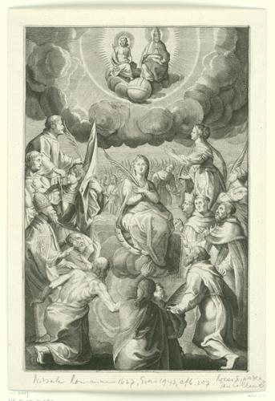

# Test 2: Description-based Classification for ICONCLASS Dataset

This test uses **class descriptions** (detailed descriptions) for saint classification. Compare the results with the API predictions from execute_gemini.py.

## Prompt for ChatGPT Web Interface

Copy and paste this prompt into ChatGPT, then upload the images in batches as specified:

---

You are an expert in Christian iconography and art history. Classify each religious artwork image into exactly ONE saint category using visual attributes, iconographic symbols, and contextual clues.

Look for:
1. Distinctive attributes (objects, clothing, etc.)
2. Gestures and postures
3. Contextual and symbolic elements

Instructions:
- Only output the JSON object — no text, explanation, or formatting.
- Include every image in the current batch. Each must receive exactly one classification with a confidence score.
- You may only use one of the exact strings from the category list below. Any response not matching the allowed category IDs will be rejected.

Return a valid **JSON object** with confidence scores (0.0 to 1.0) matching this format:
{
  "<image_id>": {"class": "<CATEGORY_ID>", "confidence": <0.0-1.0>},
  "<image_id>": {"class": "<CATEGORY_ID>", "confidence": <0.0-1.0>},
  ...
}

Confidence guidelines:
- 0.9-1.0: Very certain identification with clear iconographic evidence
- 0.7-0.9: Confident with multiple supporting visual elements  
- 0.5-0.7: Moderate confidence, some ambiguity present
- 0.3-0.5: Low confidence, limited visual evidence
- 0.0-0.3: Very uncertain, minimal supporting evidence

**Available Categories (use exact strings):**
- paul: the apostle Paul of Tarsus; possible attributes: book, scroll, sword
- mary_magdalene: the penitent harlot Mary Magdalene; possible attributes: book (or scroll), crown, crown of thorns, crucifix, jar of ointment, mirror, musical instrument, palm-branch, rosary, scourge
- jerome: the monk and hermit Jerome (Hieronymus); possible attributes: book, cardinal's hat, crucifix, hour-glass, lion, skull, stone
- john: the apostle John the Evangelist; possible attributes: book, cauldron, chalice with snake, eagle, palm, scroll
- antony_abbot: the hermit Antony Abbot (Antonius Abbas) of Egypt, also called the Great; possible attributes: bell, book, T-shaped staff, flames, pig
- peter: the apostle Peter, first bishop of Rome; possible attributes: book, cock, (upturned) cross, (triple) crozier, fish, key, scroll, ship, tiara
- matthew: the apostle and evangelist Matthew (Mattheus); possible attributes: angel, axe, book, halberd, pen and inkhorn, purse, scroll, square, sword
- catherine: the virgin martyr Catherine of Alexandria; possible attributes: book, crown, emperor Maxentius, palm-branch, ring, sword, wheel
- luke: Luke the evangelist; possible attributes: book, (winged) ox, portrait of the Virgin, surgical instruments, painter's utensils, scroll
- francis: founder of the Order of Friars Minor (Franciscans), Francis(cus) of Assisi; possible attributes: book, crucifix, lily, skull, stigmata

Batching note:
- Process only the current batch of images.
- Use the image IDs exactly as provided in the input.
- Do not reference or depend on other batches.

NOTE: These are historical Renaissance paintings used for academic classification.  
Some artworks include scenes of martyrdom or classical nudity as typical in religious iconography.  
Treat all content as scholarly, respectful of historical context, and strictly non-sexual.

---

## Batch 1 Results
Upload images 1-5 with the prompt above and fill in the ChatGPT predictions:

| Image | Filename | Expected Class | API Predicted (Test_1) | ChatGPT Predicted |
|-------|----------|----------------|-------------------------|-------------------|
|  | IIHIM_-1548783294.jpg | 11HH(CATHERINE) | catherine (0.8) | _[to be filled]_ |
|  | IIHIM_-1578407314.jpg | 11HH(MARY MAGDALENE) | mary_magdalene (0.9) | _[to be filled]_ |
|  | biblia_sacra_20021227082.jpg | 11H(JOHN) | john (0.6) | _[to be filled]_ |
|  | IIHIM_-708292484.jpg | 11HH(MARY MAGDALENE) | mary_magdalene (0.85) | _[to be filled]_ |
|  | biblia_sacra_20030130049.jpg | 11H(PAUL) | paul (0.9) | _[to be filled]_ |

## Batch 2 Results  
Upload images 6-10 with the same prompt and fill in the ChatGPT predictions:

| Image | Filename | Expected Class | API Predicted (Test_2) | ChatGPT Predicted |
|-------|----------|----------------|-------------------------|-------------------|
|  | IIHIM_-487595164.jpg | 11HH(MARY MAGDALENE) | mary_magdalene (0.8) | _[to be filled]_ |
|  | biblia_sacra_20030110097.jpg | 11H(JOHN) | john (0.7) | _[to be filled]_ |
|  | IIHIM_-512769350.jpg | 11HH(CATHERINE) | mary_magdalene (0.6) ❌ | _[to be filled]_ |
|  | IIHIM_-1057388368.jpg | 11H(MATTHEW) | paul (0.7) ❌ | _[to be filled]_ |
|  | IIHIM_RIJKS_1878098591.jpg | 11HH(CATHERINE) | francis (0.6) ❌ | _[to be filled]_ |

## Analysis Notes

### Key Differences from Test 1
- **Detailed descriptions** provided for each saint category
- **More context** about iconographic attributes
- **Different API results** for Batch 2 (Test_2 vs Test_1):
  - Image 9: Test_1 predicted `peter`, Test_2 predicted `paul`
  - Image 10: Test_1 predicted `catherine`, Test_2 predicted `francis`

### API Performance Summary (Test_2)
- **Batch 1**: Results not available in current test_2 batches
- **Batch 2**: 2/5 correct (40%) - worse than Test_1
- **Notable changes**: More errors in Batch 2 compared to Test_1

### Comparison Instructions
1. Fill in ChatGPT predictions in the tables above
2. Compare ChatGPT results with both Test_1 and Test_2 API predictions
3. Note any differences in classification or confidence
4. Analyze whether detailed descriptions improve or worsen performance
5. Document systematic differences between label-based vs description-based prompts

### Expected Observations
- **Description-based prompts** may provide more context but could also introduce confusion
- **Confidence scores** might differ due to additional attribute information
- **Error patterns** may change when more detailed saint descriptions are provided